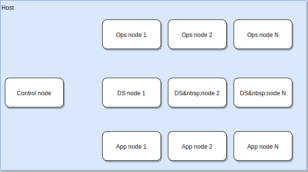

The first step is to configure your development environment.  This project
will strive to keep the dependencies you'll need to install to the bare minimum.

Where:

|Name|Description|
|-----------:|-----------|
|Host|Your laptop or workstation|
|Control node|The bootstrap node. This will be the system from which you'll use to build and configuration the rest of the nodes.|
|Ops node|The operations nodes.  These will contain the meta-system nesscary to support the enterprise build system.|
|DS node|The data store nodes.  These will contain any persistance storage required by the rest of the enterprise environment.|
|App node|The application nodes.  These will contained the applications development in the entprise environment|
